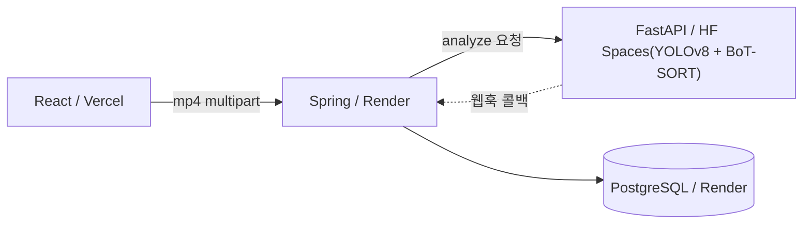

# 🛒 RetailLens — 무인매장 Vision Analytics 플랫폼

매장 CCTV 녹화본을 업로드하면 YOLOv8 + BoT-SORT 기반 비식별 추적으로 방문자 trajectory를 만들고, 체류시간·구역별 동선·추정 인구통계·추정 구매전환·heatmap 등 비즈니스 인사이트로 변환한다. **POS의 사각지대인 '고객 특성'을 익명·집계 분석으로 보완**한다.

## 라이브 데모

| 구성                | URL                                           |
| ------------------- | --------------------------------------------- |
| 대시보드 (Frontend) | https://retaillens.vercel.app/                |
| Backend API         | https://retaillens-backend.onrender.com       |
| AI Server           | https://rosyhey-retaillens-ai-server.hf.space |

> Free 티어라 첫 접속 시 cold start (1~5분) 발생.

## 데모 시나리오

**1.** mp4 업로드 → 영상 첫 프레임이 캔버스에 표시됨
**2.**마우스로 키오스크/매대 영역(관심구역)을 직접 드래그해서 ROI 지정
**3.** "분석 시작" → 비동기 분석 진행 → 통계·차트·heatmap 자동 표시

## 아키텍처 (폴리글랏 + 비동기 콜백)

- **비동기 콜백**: FastAPI가 202 즉시 응답 + BackgroundTasks 분석 → Spring 웹훅으로 결과 push (무료 티어 504 타임아웃 회피)
- **Trajectory → Insight**: Virtual Line Crossing(입장), ROI Dwell(체류), Estimated Purchase(룰베이스), Heatmap

## 기술 스택

| 영역      | 기술                                                  |
| --------- | ----------------------------------------------------- |
| Frontend  | React 19, Vite, Recharts                              |
| Backend   | Java 21, Spring Boot 3.5, JPA                         |
| AI Server | Python 3.11, FastAPI, Ultralytics YOLOv8, BoT-SORT    |
| DB        | PostgreSQL 17 (JSONB)                                 |
| 배포      | Vercel / Render / HuggingFace Spaces (모두 무료 티어) |

## 모듈

- [`ai-server/`](./ai-server) — YOLO 추론 + 분석 로직
- [`backend/`](./backend) — Job 관리 + Stats/Heatmap API
- [`frontend/`](./frontend) — 업로드 + 대시보드
- [`db/`](./db) — 스키마

## 개인정보 원칙

얼굴 원본 미저장 · 익명 visitor_id · aggregate-only · 추정값(estimated_) 명시 · 분석 후 영상 삭제

## 로드맵

- [X] P1: YOLO+BoT-SORT 파이프라인, 비동기 콜백, 배포
- [X] P2: React 대시보드 (통계·차트·heatmap)
- [ ] P3: MiVOLO 인구통계 / Gemini RAG 자연어 질의
