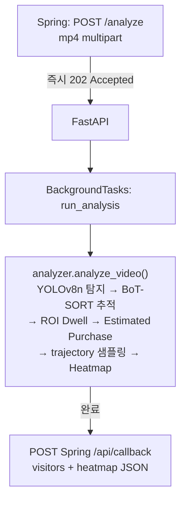

# RetailLens — AI Server (FastAPI)

무인매장 Vision Analytics의 추론 모듈. 업로드된 mp4 영상을 YOLOv8 + BoT-SORT로 사람 탐지·추적하고, Virtual Line Crossing·ROI Dwell·Estimated Purchase·Heatmap 등 비즈니스 로직을 적용한 결과를 SpringBoot 백엔드에 비동기 콜백으로 push.

## 기술 스택

| 영역          | 도구                            | 버전   |
| ------------- | ------------------------------- | ------ |
| Language      | Python                          | 3.11+  |
| Framework     | FastAPI                         | 0.115+ |
| ASGI          | Uvicorn                         | 0.30+  |
| 객체 탐지     | Ultralytics YOLOv8 (yolov8n.pt) | 8.3+   |
| 다중객체 추적 | BoT-SORT (Ultralytics 내장)     | -      |
| 영상 처리     | OpenCV (headless)               | 4.10+  |
| HTTP Client   | httpx                           | 0.27+  |

## 아키텍처 — 비동기 콜백 (BackgroundTasks)



Render/HF 무료 티어의 30~120초 HTTP 타임아웃을 회피하기 위해 동기 long-running 응답을 제거.
영상 분석은 BackgroundTasks에서 진행되고, 완료 시 웹훅으로 결과를 push.

## 폴더 구조

```text
ai-server/
├─ main.py            # FastAPI 앱, 라우트, multipart 수신, BackgroundTasks 등록
├─ analyzer.py        # YOLO + BoT-SORT + 비즈니스 로직 (핵심)
├─ requirements.txt
├─ Dockerfile         # HF Spaces 배포용
└─ README.md
```

## 환경 설정

### requirements.txt

```text
fastapi>=0.115
uvicorn[standard]>=0.30
httpx>=0.27
pydantic>=2.7
python-multipart>=0.0.9
ultralytics>=8.3.0
opencv-python-headless>=4.10
lap>=0.5.12
```

### 환경 변수 (.env)

```text
SPRING_CALLBACK_URL=http://localhost:8080/api/callback
PORT=8000
```

## 실행

루트의 `.venv` 활성화 후:

```bash
cd ai-server
uvicorn main:app --reload --port 8000
```

`http://localhost:8000` 에서 가동. Swagger UI는 `/docs`.

## API 명세

| Method | Endpoint     | 응답         | 설명                                                                 |
| ------ | ------------ | ------------ | -------------------------------------------------------------------- |
| GET    | `/health`  | 200          | 헬스체크                                                             |
| POST   | `/analyze` | 202 Accepted | 영상 분석 의뢰 (multipart 업로드, BackgroundTasks 등록 후 즉시 응답) |

### POST /analyze 요청 (multipart/form-data)

| 필드       | 타입 | 설명                     |
| ---------- | ---- | ------------------------ |
| `job_id` | text | Spring이 생성한 Job UUID |
| `video`  | file | 분석할 mp4 파일          |

### 콜백 (FastAPI → Spring `POST /api/callback`)

```json
{
  "job_id": "...",
  "status": "DONE",
  "visitors": [
    {
      "visitor_id": 10,
      "estimated_age_band": null,
      "estimated_gender": null,
      "enter_at_sec": 0.0,
      "exit_at_sec": 11.4,
      "dwell_sec": 11.4,
      "visited_checkout": true,
      "checkout_dwell_sec": 4.16,
      "estimated_purchase": true,
      "trajectory": [{"x": 540, "y": 660, "t": 0.0}]
    }
  ],
  "heatmap": {
    "grid_width": 32,
    "grid_height": 18,
    "data": [[0.01, 0.02]]
  }
}
```

## 핵심 분석 로직 (analyzer.py)

PRD §6.5 기반 분석 파이프라인:

| 로직                  | 구현                                                                                  |
| --------------------- | ------------------------------------------------------------------------------------- |
| Confidence 필터       | YOLO 추론 시 `conf=0.5` — 마네킹 등 false positive 제거                            |
| 트래킹 ID 노이즈 제거 | 10 프레임 미만 trajectory는 visitor에서 제외                                          |
| Virtual Line Crossing | 세로 중앙선(`entry_line_ratio=0.5`)을 위→아래로 통과한 ID만 입장 카운트            |
| ROI Dwell             | 사용자 정의 직사각형(`roi_ratio`) 내 머문 누적 프레임 → 초로 환산                  |
| Estimated Purchase    | `visited_checkout AND checkout_dwell ≥ checkout_min_dwell_sec` (default 3.0s)      |
| Trajectory 샘플링     | 초당 5프레임 처리(vid_stride=fps/5) + 결과는 1초당 1점으로 저장 → DB·연산 부담 최소 |
| Heatmap 생성          | 모든 trajectory (x,y) 누적 → GaussianBlur → 32×18 그리드 JSON                      |

### 주요 파라미터 (조정 가능)

```python
analyze_video(
    video_path,
    conf_threshold=0.5,
    min_trajectory=10,
    entry_line_ratio=0.5,
    roi_ratio={ 'x_min': 0.25, 'y_min': 0.30, 'x_max': 0.75, 'y_max': 0.85 },
    checkout_min_dwell_sec=3.0,
)
# 내부 추론 최적화:
#   imgsz=480          - 추론 해상도 다운스케일 (CPU 환경 약 4배 가속)
#   vid_stride=fps/5   - 초당 5프레임만 처리 (속도/추적 정확도 균형)
```

> ROI는 영상 유형에 따라 "관심 구역(Interest Zone)"으로 일반화 가능 — 계산대·신상품 매대·핫존 등.

## 주요 설계 결정

- **모델 lazy load + 단일 인스턴스**: `_get_model()`로 첫 요청 시 1회 로딩 후 재사용
- **`stream=True`**: Ultralytics 결과를 generator로 받아 메모리 OOM 방지
- **CPU bound → 별도 thread**: `loop.run_in_executor()`로 이벤트 루프 점유 방지
- **Trajectory 1초 샘플링**: 1,500점 → 60점 수준으로 압축
- **분석 후 영상 즉시 삭제**: `os.remove()`로 업로드 파일 폐기 (개인정보 원칙)
- **CCTV 하이앵글 가정**: 얼굴 기반 인구통계(MiVOLO)는 P3 옵션. 본 모듈은 trajectory 분석에 집중

## 배포 (HuggingFace Spaces)

Docker SDK 기반 자동 빌드 (`Dockerfile` + README frontmatter: `sdk: docker`, `app_port: 7860`).

- 배포 URL: https://rosyhey-retaillens-ai-server.hf.space
- 헬스체크 `/health`, API 문서 `/docs`
- 하드웨어: CPU basic (무료), 영구 스토리지 없음 (모델 시작 시 자동 다운로드)

### 필수 환경변수 (HF Spaces Settings)

| Key                     | 설명                                                                                                                   |
| ----------------------- | ---------------------------------------------------------------------------------------------------------------------- |
| `SPRING_CALLBACK_URL` | backend 콜백 URL (예:`https://retaillens-backend.onrender.com/api/callback`) — 미설정 시 localhost로 향해 콜백 실패 |

Dockerfile에 `ENV PYTHONUNBUFFERED=1` 포함 — print 로그가 실시간으로 Logs에 노출되도록.

## 진행 현황 및 로드맵

### 완료

- [X] YOLOv8 + BoT-SORT 추적 파이프라인
- [X] Virtual Line Crossing / ROI Dwell / Estimated Purchase 로직
- [X] Heatmap 좌표 누적 → Spring 저장·조회 API 노출
- [X] multipart 영상 업로드
- [X] HuggingFace Spaces 배포

### 향후 과제

- [ ] 인구통계 ID별 캐싱 (P3 — MiVOLO 연령·성별 추정)
- [ ] 모델 ONNX 변환 (CPU 추론 속도 최적화)
- [ ] HF Persistent Storage 활용 (yolov8n.pt 재다운로드 방지)
- [ ] 업로드 영상 해상도 가드레일 (720p 이하 권장)
