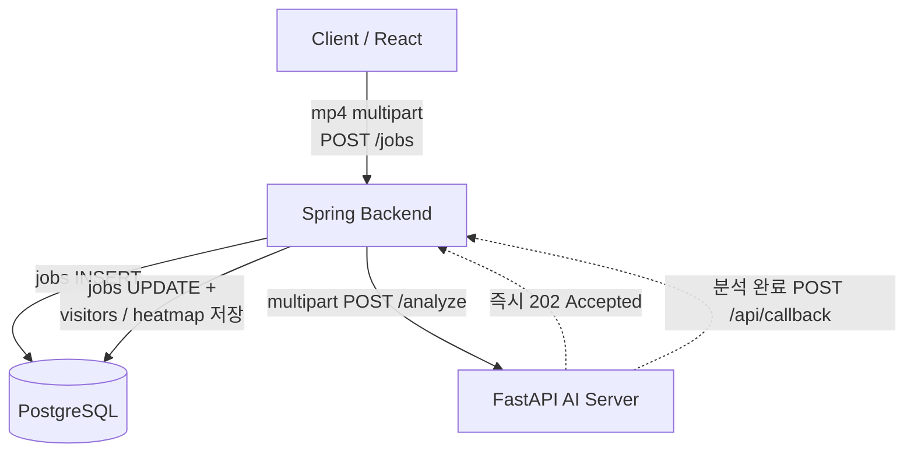

# RetailLens — Backend (Spring Boot)

무인매장 Vision Analytics 플랫폼의 백엔드 모듈. 영상 분석 Job을 관리하고, AI 서버(FastAPI)와 비동기 콜백으로 통신하며, PostgreSQL에 결과(visitors·heatmap)를 저장하고 KPI를 집계한다.

## 기술 스택

| 영역        | 도구                        | 버전          |
| ----------- | --------------------------- | ------------- |
| Language    | Java                        | 21 (Temurin)  |
| Framework   | Spring Boot                 | 3.5.14        |
| Build       | Gradle                      | 8.x (wrapper) |
| ORM         | Spring Data JPA + Hibernate | 6.6.x         |
| DB          | PostgreSQL                  | 17            |
| HTTP Client | Spring RestClient           | -             |
| Util        | Lombok, Validation          | -             |

## 아키텍처 — 비동기 콜백 패턴



Render Free Tier의 504 타임아웃 방지를 위해 동기 long-running 요청을 제거. FastAPI는 202를 즉시 반환하고 백그라운드로 처리한 뒤, Spring 웹훅(`/api/callback`)으로 결과를 push한다.

## 폴더 구조

```text
backend/
├─ Dockerfile                          # Render 배포 (multi-stage)
├─ build.gradle
└─ src/main/
   ├─ java/com/retaillens/backend/
   │  ├─ BackendApplication.java
   │  ├─ config/
   │  │  ├─ RestClientConfig.java       # HTTP/1.1 강제 (uvicorn 호환)
   │  │  └─ WebConfig.java              # CORS (React/Vercel 호출 허용)
   │  ├─ controller/
   │  │  ├─ JobController.java          # POST /jobs(multipart), GET /jobs/{id}, /jobs/{id}/heatmap
   │  │  ├─ CallbackController.java     # POST /api/callback (FastAPI 웹훅 수신)
   │  │  └─ StatsController.java        # GET /stats, /stats/{jobId}
   │  ├─ service/
   │  │  ├─ JobService.java             # Job 생성·dispatch·콜백 처리
   │  │  └─ StatsService.java           # KPI 집계
   │  ├─ entity/
   │  │  ├─ Job.java                    # jobs (heatmap JSONB 포함)
   │  │  └─ Visitor.java                # visitors (trajectory JSONB)
   │  ├─ repository/
   │  │  ├─ JobRepository.java
   │  │  └─ VisitorRepository.java
   │  └─ dto/
   │     ├─ JobResponse.java
   │     ├─ CallbackPayload.java        # FastAPI 수신 (visitors + heatmap)
   │     ├─ VisitorResult.java
   │     └─ StatsResponse.java          # KPI 집계 응답
   └─ resources/application.yml
```

> `JobCreateRequest`, `AnalyzeRequest`는 multipart 전환으로 미사용(주석 처리).

## 환경 설정

### 사전 요구사항

- JDK 21 (Temurin)
- PostgreSQL 17 (로컬: `retaillens` DB / `retaillens` user)
- DB 스키마 적용 (`db/schema.sql`)

### application.yml

```yaml
server:
  port: ${PORT:8080}                      # Render가 PORT 주입
spring:
  datasource:
    url: ${SPRING_DATASOURCE_URL:jdbc:postgresql://localhost:5432/retaillens}
    username: ${SPRING_DATASOURCE_USERNAME:retaillens}
    password: ${SPRING_DATASOURCE_PASSWORD:retaillens_dev}
  jpa:
    hibernate:
      ddl-auto: validate
    show-sql: true
  jackson:
    property-naming-strategy: SNAKE_CASE
  servlet:
    multipart:
      max-file-size: 50MB                 # 영상 업로드 한계
      max-request-size: 50MB
ai-server:
  url: ${AI_SERVER_URL:http://localhost:8000}
```

> `:` 뒤는 로컬 기본값. 배포 시 환경변수로 override.

## 실행

```bash
cd backend
./gradlew bootRun        # 첫 실행은 의존성 다운로드로 1~3분
```

`http://localhost:8080` 가동. 종료 `Ctrl+C`.

## API 명세

| Method | Endpoint               | 설명                                                                         |
| ------ | ---------------------- | ---------------------------------------------------------------------------- |
| POST   | `/jobs`              | 영상(mp4) 업로드 → Job 생성 + FastAPI 분석 의뢰 (202)                       |
| GET    | `/jobs/{id}`         | Job 진행 상태·결과 조회 (React polling)                                     |
| GET    | `/jobs/{id}/heatmap` | 해당 Job의 heatmap JSON (32×18)                                             |
| POST   | `/api/callback`      | FastAPI 분석 완료 웹훅 수신                                                  |
| GET    | `/stats`             | 전체 visitors 집계 KPI                                                       |
| GET    | `/stats/{jobId}`     | 특정 Job의 집계 KPI                                                          |
| POST   | `/jobs`              | 영상(mp4) + (optional) ROI 좌표 업로드 → Job 생성 + FastAPI 분석 의뢰 (202) |

### 집계 KPI (GET /stats)

| KPI                       | 설명                             |
| ------------------------- | -------------------------------- |
| visitor_count             | 총 방문자 수                     |
| avg_dwell_sec             | 평균 체류 시간                   |
| estimated_conversion_rate | 추정 구매 전환율                 |
| no_purchase_count         | 미구매 추정 방문자 수            |
| checkout_visit_count      | ROI(관심구역) 방문자 수          |
| avg_checkout_dwell_sec    | 평균 ROI 체류 시간               |
| age_distribution          | 추정 연령대 분포 (P3에서 채워짐) |
| gender_distribution       | 추정 성별 분포 (P3에서 채워짐)   |

> 인구통계 2종은 현재 unknown. P3에서 MiVOLO 통합 시 실제 값으로 채워짐.

### 호출 예시 (multipart)

```bash
curl -X POST http://localhost:8080/jobs \
  -F "video=@../notebooks/experiments/test_video3.mp4" \
  -F "roi_x_min=888" -F "roi_y_min=82" \
  -F "roi_x_max=1141" -F "roi_y_max=471"
# → 202 Accepted + JSON (id, status=RUNNING)

curl http://localhost:8080/jobs/<id>        # status=DONE, progress=100
curl http://localhost:8080/stats/<id>       # KPI 집계
```

## End-to-End 테스트 절차

1. PostgreSQL 실행 확인
2. ai-server 기동 (`cd ../ai-server && uvicorn main:app --reload --port 8000`)
3. backend 기동 (`./gradlew bootRun`)
4. 위 multipart curl 호출 → DBeaver에서 `SELECT * FROM visitors WHERE job_id = '<id>'` 로 방문자 행 확인 (테스트 영상 기준 약 16행)

## 주요 설계 결정

- **`SimpleClientHttpRequestFactory`**: JDK 21 기본 HttpClient의 자동 HTTP/2 upgrade가 uvicorn(HTTP/1.1)과 충돌해 body가 누락되는 문제 회피
- **multipart 영상 전달**: 업로드된 영상을 `ByteArrayResource`로 감싸 ai-server에 multipart 전송 (max 50MB)
- **CORS 글로벌 설정**(`WebConfig`): React/Vercel 프론트엔드 호출 허용
- **DTO 기반 콜백 수신**: Spring Jackson SNAKE_CASE로 FastAPI의 snake_case JSON 자동 매핑
- **JSONB 매핑**: Hibernate 6.x `@JdbcTypeCode(SqlTypes.JSON)`로 trajectory·heatmap을 PostgreSQL JSONB와 직접 매핑

## 배포 (Render)

Docker 기반 Render Web Service 배포.

- 배포 URL: https://retaillens-backend.onrender.com
- Runtime: Docker (`backend/Dockerfile`, multi-stage)
- Plan: Free (512MB, `-Xmx400m`), Region: Singapore
- Cold start: 첫 요청 시 30초~1분

### 환경변수 (Render 주입)

| Key                            | 설명                                                                                                         |
| ------------------------------ | ------------------------------------------------------------------------------------------------------------ |
| `PORT`                       | Render 자동 주입                                                                                             |
| `SPRING_DATASOURCE_URL`      | `jdbc:postgresql://<internal-host>:5432/retaillens`                                                        |
| `SPRING_DATASOURCE_USERNAME` | DB 사용자                                                                                                    |
| `SPRING_DATASOURCE_PASSWORD` | DB 비밀번호                                                                                                  |
| `AI_SERVER_URL`              | HuggingFace Spaces ai-server 주소<br />* 이 값이 잘못되면 backend가 ai-server를 호출하지 못해 Job이 FAILED됨 |

## 진행 현황 및 로드맵

### 완료

- [X] Job 관리 + 비동기 콜백 (FastAPI ↔ Spring 웹훅)
- [X] visitors / heatmap 저장, KPI 집계 API
- [X] multipart 영상 업로드 + CORS
- [X] Render 배포
- [X] ROI 좌표를 ai-server로 multipart 전달

### 향후 과제

- [ ] Spring AI + Gemini RAG 자연어 질의 (P3)
- [ ] 시간대별·인구통계별 stats 집계 고도화 (`recorded_at` 활용)
- [ ] CORS origin을 Vercel 도메인으로 제한 (보안 강화)
